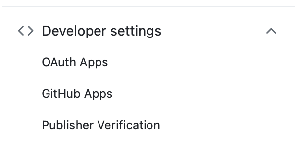
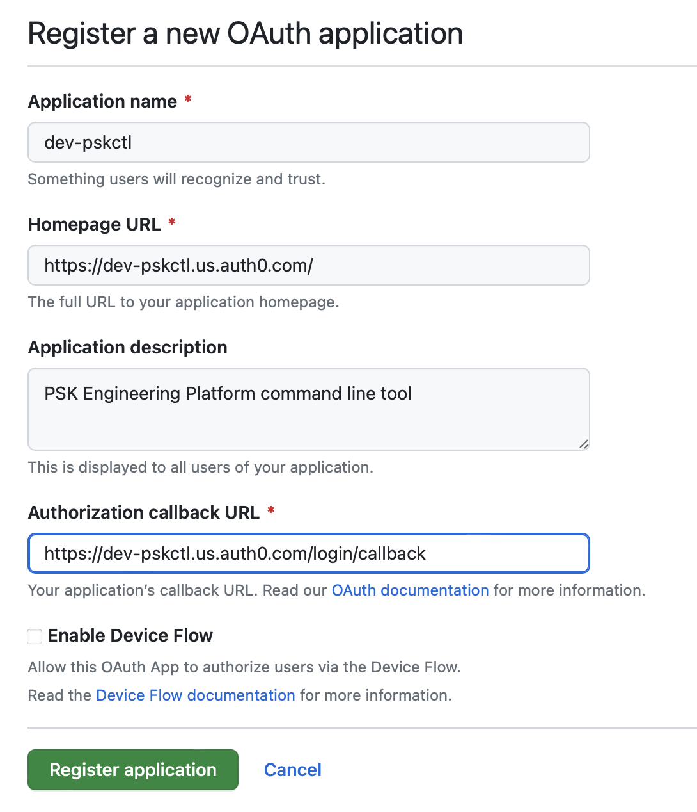
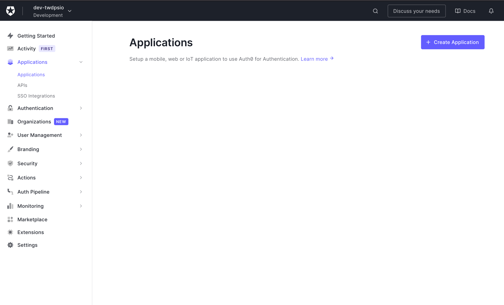
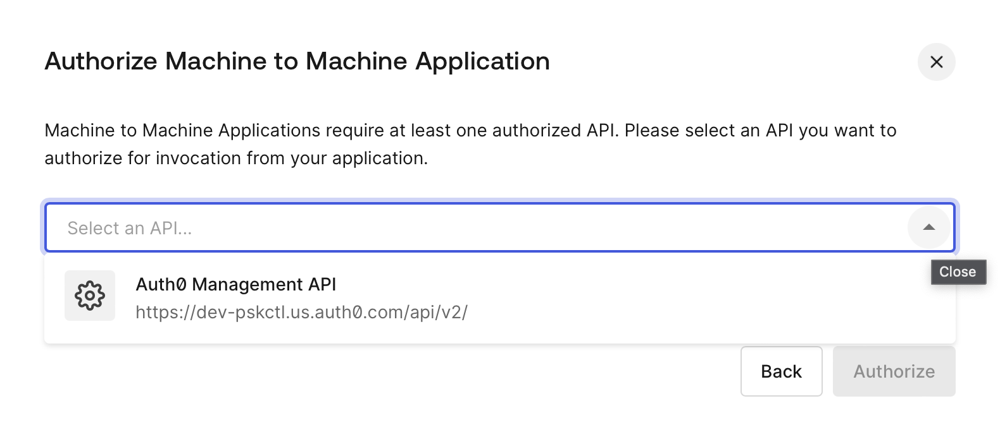
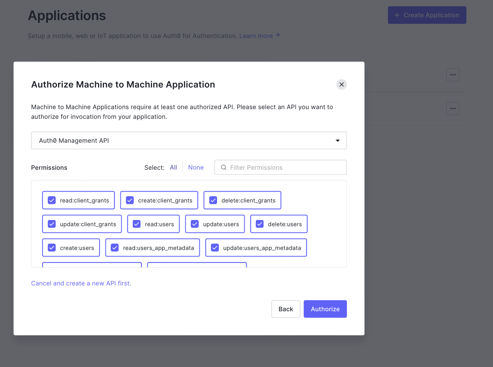
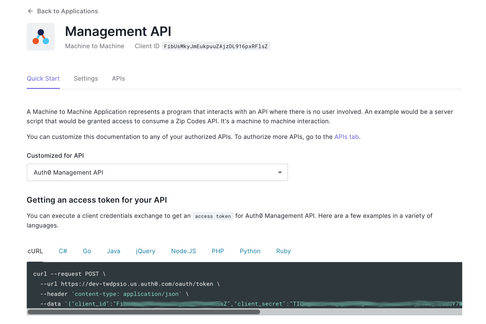

	

		
     
		
	

   
  <h3>bootstrap steps for setting up Auth0.com for use with pskctl</h3>

 

The PSK example engineering platform demonstrates use of dedicated, external authentication and authorization for customers (developers) using the platform.  

Auth0 is used at the identity provider framework. Implemented as only a pass-through framework, Auth0 does not retain any user details or claims information. Role-based authorization within the platform is based on team membership. Github is used as the source for both, with actual github 'Teams' information used as the user claims.

## Auth0 tenant configuration

Auth0 plays an important role in enabling the PSK platform cli to use github and github team membership for authentication and authorization with the engineering platform. While a critical component, it is also a fairly narrow slice of the overall flow.  

When a developer (customer) of the Platform uses the cli to `login`, auth0 coordinates the pass-through to Github for authentication, and it fetches the users 'claims' in the form of their team memberships within the Github organization. These are inserted into the returned id-token. Each individual use of the resulting token involves completely seperate authorization automation depending on the target of the request.  

Because of this, the amount of configuration and the resulting testing needed is also quite limited. And, since the authenication workflow reuqires human interaction by design, while the configuration of the idp is automated there is a limited amount of automated testing that can used to validate the resulting idp Client. Mostly, when changes to the configuration are needed, the changes are pushed to the dev-tenant and then human interactive testing is used to validate the results.  

###  Create Oauth App in GitHub Organization

To start you need to create both dev and production oauth-apps in your github organization that Auth0 can use to access user information. This example relates to the PSK cli so it will refer to the oauth-apps as dev-pskctl and pskctl (for prod). Note, in this context dev or prod do not directly refer to development or production environments within the engineering platform. The Dev instances of the auth0 configuration is used only for testing the automated configuration of the auth0 tenant. As part of validating the configuration, the initial platform product teams development role cluster(s) (in our case, sbx-dev) is configured to use the dev-pskctl tenant. But all other clusters will use the prod auth0 tenant whether they are used for production workloads, non-production, or even non-customer facing. In both cases, these are part of a single github organization.  

1. In the GitHub **Organization** settings, open `Oauth Apps` under `Developer Settings`

2. Click the `New Org OAuth App` button in the upper right.  

3. Enter the necessary info the for the dev-pskctl auth0 tenant **dev-pskctl.us.auth0.com**

> Note: You do not need to check Enable Device Flow here as this will be managed by Auth0

On the screen that follows, create a new `Client Secret`. Save both the Client ID and the Client Secret in your secrets store.  

1. Repeat for **pskctl.us.auth0.com**

### Bootstrap Management API client in Auth0

1. Create an account on auth0.com, using github authentication - free tier is all that is needed

2. Create two tenants:

* dev-pskctl
* pskctl

1. Swtich to the dev-pskctl tenant. Go to the applications dashboard and click `Create Application`.  

  

Set the name for the new application to `Management API` and choose Machine-to-Machine-Application and the app type.  

  

On the screen that follows, select the 'Auth0 Managment API' option from the popup.  

  

Next, Under Permissions click `Select: All` and click `Authorize`  

  

From the example window, copy the client_id and client_secret and store these in your secrets store.

  

2. Repeat for `pskctl`

_The related auth.com documentation_:  
- [machine-to-machine apps](https://auth0.com/docs/get-started/auth0-overview/create-applications/machine-to-machine-apps)
- [Managegment API Tokens](https://auth0.com/docs/secure/tokens/access-tokens/get-management-api-access-tokens-for-production)

Lab members see maintainers notes [here](https://github.com/ThoughtWorks-DPS/documentation-internal/blob/main/doc/maintainers.md).

### Create Social Connection to Github.com

_note. Not yet found a way to use auth0 management api for creation of social connections_

Create social connection for each tenant, use the dev-dpsctl github oauth-app credentials for the dev auth0 tenant, and the dpsctl github oauth-app credentials for the production tenant.  

  

Use the following claims with the client-id and client-secret for the respective tenant.  

  
